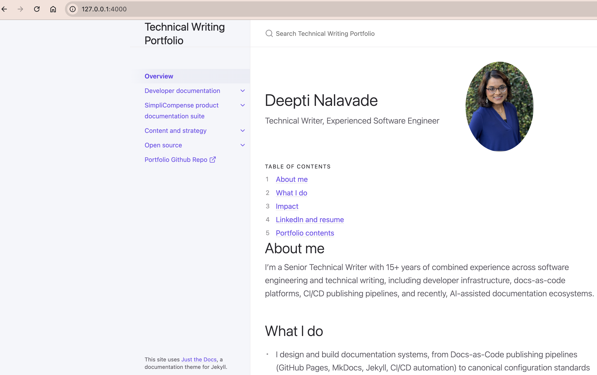

# Deepti's Technical Writing Portfolio

**Live site: [https://deeptin1.github.io/portfolio/](https://deeptin1.github.io/portfolio/)**
    
This repository powers a GitHub Pages site that showcases samples of Deepti's technical writing (API documentation, OpenAPI specification, user guide, PRD, Information Architecture, FAQs, and so on).

The site uses [Just the Docs](https://github.com/just-the-docs/just-the-docs), a documentation theme for Jekyll.

Content follows [STYLE_GUIDE.md](STYLE_GUIDE.md), a summary of the Google developer documentation style guide rules applied throughout.

## Running locally

```
bundle exec jekyll serve --baseurl ""
```

Site will be available at `http://127.0.0.1:4000/`.



## Linting

[Vale](https://vale.sh/), configured with the [Google style rules](https://github.com/errata-ai/Google) vendored under `.github/styles/Google/`, checks `docs/` and `index.md` for style-guide violations. It runs automatically on every pull request; to run it locally:

```
vale docs index.md
# or: npm run vale
```

(Requires the Vale CLI — `brew install vale` on macOS.)

## Link checking

[`html-proofer`](https://github.com/gjtorikian/html-proofer) checks the site's links, via [`.github/workflows/check-links.yml`](.github/workflows/check-links.yml). It runs on three triggers:

* **Every pull request and push to `main`**—checks internal links only (fast, about 15–20 seconds). This is the check that shows up on PRs.
* **Weekly, every Monday at 13:00 UTC**—also checks external links, so link rot on sites this repo doesn't control (a page moving, a docs site restructuring) gets caught even when nothing here has changed.
* **On demand**—see [Running it manually](#running-it-manually) below.

### Why external checks don't run on every PR

Checking external links on every PR would make ordinary PRs fail for reasons that have nothing to do with the change being reviewed: a handful of external sites return bot-challenge responses (not real errors) to the kind of non-browser HTTP client `html-proofer` uses, so they'd fail every time regardless of what changed. Running that check weekly instead—separate from PR review—means a real failure is worth looking at, rather than something to routinely dismiss.

### Ignored domains

The external-link check ignores these domains, each confirmed to work fine in a real browser and only fail for automated clients:

* **`linkedin.com`**—returns HTTP `999`, a status code LinkedIn specifically uses to block scraping/bot traffic.
* **`citylights.com`**—its Sucuri WAF (a bot-protection service) returns an HTTP `307` challenge redirect to non-browser clients.
* **`deeptin1.github.io`** (the site's own domain)—the build used for link checking sets `--baseurl ""` so internal script/asset references match the local file layout, which makes the site's own self-referential absolute URLs (canonical tags, structured data) miss the real `/portfolio/` prefix and 404 against the live site. That's a local-build artifact, not a real content link.

With `--ignore-urls`, `html-proofer` never sends a request to these domains at all—they're filtered out before any network call happens, not checked-and-suppressed. If a link on one of these domains actually breaks for real, this check won't catch it; that blind spot is accepted in exchange for the check not crying wolf every week.

### Running it manually

1. Go to the [Actions tab](https://github.com/DeeptiN1/portfolio/actions/workflows/check-links.yml) on GitHub.
2. Click **Run workflow** (top right), choose the branch, and click the green **Run workflow** button.

   Or from the command line:

   ```
   gh workflow run check-links.yml --repo DeeptiN1/portfolio
   ```

A manual run behaves like the weekly one—it checks external links too, not just internal.

### Viewing output from the scheduled run

1. Go to the [Actions tab](https://github.com/DeeptiN1/portfolio/actions/workflows/check-links.yml).
2. Find the most recent run triggered by **Schedule** (the trigger column shows how each run started).
3. Click the run, then click the **Check links** job to see the full log, including which internal and external links were checked and any failures.

Or from the command line:

```
gh run list --repo DeeptiN1/portfolio --workflow=check-links.yml --limit 5
gh run view <run-id> --repo DeeptiN1/portfolio --log
```
